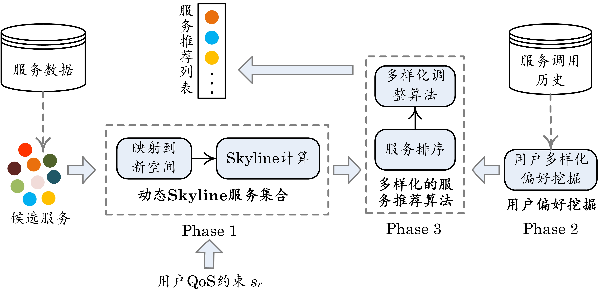

This repository is the Python implementation for the NCSC 2021 paper:
> Guosheng Kang, Jianxun Liu, Xiaoxiao Sun, Buqing Cao, Yong Xiao. "Towards Users' Potential Preferences for Diversified Service Recommendations". CCF NCSC. 2021, pp. ***-***.

## Procedure of DiSeR
  

## Dataset
The experiments were conducted on a widely used public real-world dataset named QWS [1]. This dataset can be accessed from [Zenodo](https://zenodo.org/record/3557008#.XpmwmsgzaUn) website. The dataset contains 8-dimensional quality information on 2,507 real-world Web services, including latency, availability, etc.  
[1] E. Al-Masri, and Q. H. Mahmoud, “Investigating Web Services on the World Wide Web,” International Conference on World Wide Web, 2008, pp. 795-804.

## Data preprocessing
* **Code**: [data_preprocess.py](data_preprocess.py)
* **Input**: [qws2/qws2.csv](qws2/qws2.csv)
* **Output**: [QWS.pickle](QWS.pickle)
  
### Approaches
#### Comparing Approaches
We have implemented DiQoS and other four existing representative approaches.  
**DSL-RS**: This baseline approach randomly selects k services from S_DSL.  
**DSL-KNN** [2]: This approach models services recommendation as a k nearest neighbors problem. It selects k services from S_DSL that are most similar to s_r. This is the first attempt to solve the problem of personalized quality centric service recommendation.  
**DQCSR-CC** and **DQCSR-CR** [3]: These approaches first identify the S_DSL. Then the identified services are clustered with K-Means algorithm. DQCSR-CC selects a service from each cluster which is nearest to its cluster center, and DQCSR-CR selects a service from each cluster whose coverage region has the minimum radius. This is the first attempt to handle users’ uncertain quality correlation in service recommendation.  
[2] Y. Zhang, X. Ai, Q. He, X. Zhang, W. Dou, F. Chen, L. Chen, and Y. Yang, “Personalized Quality Centric Service Recommendation,” International Conference on Service-Oriented Computing, 2017, pp. 528-544.  
[3] Y. Zhang, L. Wu, Q. He, F. Chen, S. Deng, and Y. Yang, “Diversified Quality Centric Service Recommendation,” IEEE International Conference on Web Services, 2019, pp. 126-133.
**DiSeR** [4]: This approaches first identify the S_DSL. Then a service network is built based on the identified services. A diversity measurement is introduced based on the service network. At last, a diversified service ranking model is proposed for the final service resommendation.  
[4] G. Kang, J. Liu, B. Cao, and Y. Xiao, "Diversified QoS-Centric Service Recommendation for Uncertain QoS Preferences," in IEEE International Conference on Services Computing, Beijing, China, 2020, pp. 288-295: IEEE.

#### Implementation
* **Code**: [approaches_comparison.py](approaches_comparison.py)

### Evaluation
#### Evaluate Effectiveness
* **Code**: [approaches_comparison.py](approaches_comparison.py)
* **Input**: [QWS.pickle](QWS.pickle)
* **Output**: [DCG_value_n.csv](results/DCG_value_n.csv), [Div_value_n.csv](results/Div_value_n.csv), [RMSDE_value_n](RMSDE_value_n.csv), [DCG_value_d.csv](results/DCG_value_d.csv), [Div_value_d.csv](results/Div_value_d.csv), [RMSDE_value_d](RMSDE_value_d.csv), [DCG_value_k.csv](results/DCG_value_k.csv), [Div_value_k.csv](results/Div_value_k.csv), [RMSDE_value_k](RMSDE_value_k.csv)
  
#### Evaluate Parameter Impact
  * **Code**: [approaches_parameters.py](approaches_parameters.py)
  * **Output**: [DCG_Div_RMSDE_n_top](DCG_Div_RMSDE_n_top.csv), [DCG_Div_RMSDE_lamda](DCG_Div_RMSDE_lamda.csv)
  
#### Plot Figures for Effectiveness and Parameter Impact
  * **Python Code**: [plot_effectiveness.py](plot_effectiveness.py), [plot_parameters_impact.py](plot_parameters_impact.py)
  * **Output**: [effectiveness.png](results/effectiveness.png), [impact.png](results/impact.png)
   * **Matlab Code**: [plot_effectiveness_dcg.m](plot_effectiveness_dcg.m), [plot_effectiveness_div.m.m](plot_effectiveness_div.m.m), [plot_effectiveness_rmsde](plot_effectiveness_rmsde.m), [plot_parameters_impact.m](plot_parameters_impact.m)
  * **Output**: [DCG.emf](DCG.emf), [DIV.emf](DIV.emf), [RMSDE.emf](RMSDE.emf), [impact.emf](impact.emf)

-----

欢迎并感谢您提出宝贵的问题或建议: 点击<a href='https://github.com/guoshengkang/DiSeR/issues/new'><b>【我要提问】</b></a>

